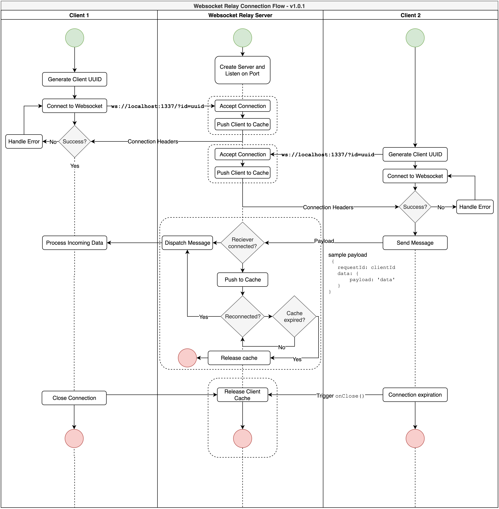

# Simple Websocket Relay

This Websocket Server acts as a relay between two clients. This server gives the option of token based authentication via a DB Server or similar service. In addition, the server supports caching of messages for a limited amount of time(10 min by default). 

Connections and Client messages are cached with the support of Redis. Therefore a Redis Server is required on the same host.

Credits: Gists from [mariotacke](https://github.com/mariotacke/blog-single-user-websocket)

### How it works

1. Each client connects to the Websocket relay with a unique ID. A UUID in this case.
	
	`ws://192.168.1.2:1337/?id=47dd72d9-32b9-414a-95e0-c05adb0ee200`

2. The connection is then stored respective to each client ID. 

3. When a message is sent from a client, the `requestId` is used to identify the recieving client.
	```
	{
		requestId: 47dd72d9-32b9-414a-95e0-c05adb0ee200,
		data: {
			payload: 'somepayload'
		}
	}
	```

4. On connection close, clients are removed from temporary collection and memory is free-ed.

### Caching capabilities

On occasions where a client has lost the connection, webserver will cache the response. Once the client connects with the same clientId, the response will be delivered again. Please note that this cache is set by the Redis Server. You have the option of modifying the time limit in the source.

### To Run

1. Start Redis Server instance. The Relay uses default redis configuration to connect to an instance, but you may modify `.env` to suit your instance.

2. Then simply, `yarn start` or `npm start`

### How to Run Tests

The tests are designed to emulate most client scenarios from Authentication, relaying a message, and testing the cache releasing functions. 

1. Start Redis Server
2. Start Websocket Relay with `yarn start` or `npm start`
3. On another, terminal prompt do `yarn run tests` or `npm run tests` 


### Detailed Flow



